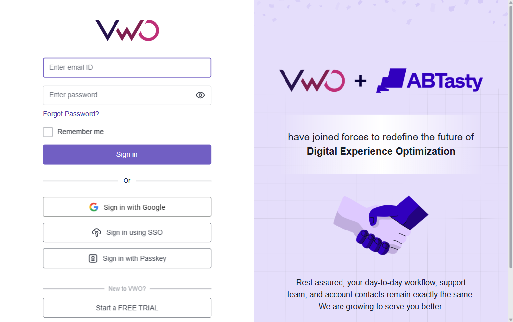

# Test Plan: VWO Login Page

| Field | Value |
|-------|-------|
| **Version** | 2.0 |
| **Author** | QA Team |
| **Date** | 2026-04-01 |
| **Environment** | Production (app.vwo.com) |
| **Browser** | Chromium, WebKit, Firefox |

---

## 1. Introduction

This test plan describes the testing approach for the **VWO Login Page** (`https://app.vwo.com/#/login`). It outlines the scope, test strategy, resources, schedule, and deliverables for the testing effort. The login page serves as the primary entry point for existing VWO users and provides multiple authentication methods including email/password, Google OAuth, SSO, and Passkey.

## 2. Objectives

- Verify all login methods (email/password, Google, SSO, Passkey) work as expected
- Validate input field validations and error messaging for incorrect credentials
- Ensure all UI elements render correctly and are interactive
- Verify navigation links (Forgot Password, Free Trial, Privacy Policy, Terms) resolve properly
- Confirm "Remember me" functionality persists sessions
- Test password visibility toggle behavior
- Validate responsive layout across desktop and mobile viewports

## 3. Scope

### In Scope
- Login via standard Email ID and Password credentials
- Input validations (empty fields, invalid email format, incorrect password, special characters)
- "Toggle password visibility" (eye icon) functionality
- "Remember me" checkbox state and session persistence
- "Forgot Password?" flow initiation
- Third-party login initiations:
  - "Sign in with Google" (Google OAuth)
  - "Sign in using SSO" (Single Sign-On)
  - "Sign in with Passkey" (WebAuthn/FIDO2)
- Navigation links: "Start a FREE TRIAL", "Privacy policy", "Terms"
- UI element verification (VWO logo, VWO + ABTasty branding panel, form layout)
- Responsive layout checks for standard desktop and mobile resolutions
- Page load performance (login page renders within acceptable time)

### Out of Scope
- Complete end-to-end testing of third-party OAuth flows (e.g., Google authentication completion)
- Load testing or backend database performance analysis
- Post-login interactions beyond successful redirection to the main dashboard
- CAPTCHA or rate-limiting behavior testing
- ABTasty branding panel content verification (marketing content)
- Email delivery for password recovery

## 4. Test Strategy

### Test Approach
- **Automation Tool:** Playwright with @playwright/test
- **Test Type:** End-to-end functional testing
- **Browser:** Chromium, WebKit, Firefox
- **Environment:** Production (app.vwo.com)

### Test Levels
- Smoke Testing (critical login path)
- Functional Testing (all features and input validations)
- Negative Testing (invalid inputs, error handling, boundary values)
- UI Testing (element visibility, layout, responsiveness)

## 5. Test Environment

| Component | Details |
|-----------|---------|
| Application URL | https://app.vwo.com/#/login |
| Browser | Chromium, WebKit, Firefox |
| OS | Cross-platform (Node.js) |
| Framework | Playwright v1.58+ |
| Reporter | HTML + JSON |
| Test Runner | @playwright/test |

## 6. Entry Criteria

- Application is deployed and accessible at `https://app.vwo.com/#/login`
- Test environment is configured with Playwright and required dependencies
- Valid and invalid test credentials are available
- Test cases are reviewed and approved
- Network connectivity to third-party auth providers is confirmed

## 7. Exit Criteria

- All planned test cases executed
- All critical/high priority defects resolved
- Test pass rate ≥ 95%
- Test report generated and reviewed
- No open blocker or critical defects

## 8. Test Cases Summary

### 8.1 Smoke Tests (Critical Path)
| Test ID | Title | Priority | Type |
|---------|-------|----------|------|
| **TC_SMOKE_01** | Verify login page loads successfully with all elements visible | Critical | Smoke |
| **TC_SMOKE_02** | Verify successful login with valid email and password | Critical | Smoke |

### 8.2 Core Authentication Tests
| Test ID | Title | Priority | Type |
|---------|-------|----------|------|
| **TC_AUTH_01** | Verify successful login with valid Email ID and Password | High | Functional |
| **TC_AUTH_02** | Verify error message with invalid Password | High | Negative |
| **TC_AUTH_03** | Verify error message with unregistered Email ID | High | Negative |
| **TC_AUTH_04** | Verify validation when both Email and Password fields are empty | High | Negative |
| **TC_AUTH_05** | Verify validation when only Email field is empty | Medium | Negative |
| **TC_AUTH_06** | Verify validation when only Password field is empty | Medium | Negative |
| **TC_AUTH_07** | Verify validation for malformed Email ID (missing "@" or domain) | Medium | Negative |
| **TC_AUTH_08** | Verify login with email containing leading/trailing spaces | Low | Boundary |
| **TC_AUTH_09** | Verify login with SQL injection strings in email/password fields | Medium | Security |
| **TC_AUTH_10** | Verify login with XSS script tags in email/password fields | Medium | Security |
| **TC_AUTH_11** | Verify login with maximum length email and password | Low | Boundary |

### 8.3 UI and Usability Tests
| Test ID | Title | Priority | Type |
|---------|-------|----------|------|
| **TC_UI_01** | Verify VWO logo is displayed at the top of the login form | Medium | UI |
| **TC_UI_02** | Verify Email field has placeholder text "Enter email ID" | Low | UI |
| **TC_UI_03** | Verify Password field has placeholder text "Enter password" | Low | UI |
| **TC_UI_04** | Verify password is masked by default (type="password") | Medium | UI |
| **TC_UI_05** | Verify clicking the eye icon toggles password visibility (masked ↔ plain text) | Medium | Usability |
| **TC_UI_06** | Verify "Remember me" checkbox is unchecked by default | Low | UI |
| **TC_UI_07** | Verify "Remember me" checkbox can be toggled on and off | Medium | Functional |
| **TC_UI_08** | Verify checking "Remember me" persists session after browser restart | Medium | Functional |
| **TC_UI_09** | Verify "Sign in" button is visible and clickable | High | UI |
| **TC_UI_10** | Verify "Or" divider separates primary and alternative login methods | Low | UI |
| **TC_UI_11** | Verify VWO + ABTasty branding panel renders on the right side | Low | UI |
| **TC_UI_12** | Verify Email field receives focus on page load | Low | Usability |
| **TC_UI_13** | Verify Tab key navigates through form fields in correct order | Low | Accessibility |
| **TC_UI_14** | Verify pressing Enter in password field submits the form | Medium | Usability |

### 8.4 Alternative Login Methods
| Test ID | Title | Priority | Type |
|---------|-------|----------|------|
| **TC_ALT_01** | Verify "Sign in with Google" button invokes Google OAuth modal | High | Functional |
| **TC_ALT_02** | Verify "Sign in using SSO" button routes to SSO portal | High | Functional |
| **TC_ALT_03** | Verify "Sign in with Passkey" button prompts system Passkey dialog | High | Functional |
| **TC_ALT_04** | Verify Google sign-in button displays Google icon | Low | UI |
| **TC_ALT_05** | Verify SSO button displays SSO icon | Low | UI |
| **TC_ALT_06** | Verify Passkey button displays Passkey icon | Low | UI |

### 8.5 Navigation and Links
| Test ID | Title | Priority | Type |
|---------|-------|----------|------|
| **TC_NAV_01** | Verify "Forgot Password?" opens password recovery flow | High | Navigation |
| **TC_NAV_02** | Verify "Start a FREE TRIAL" link navigates to `https://vwo.com/free-trial/` | Medium | Navigation |
| **TC_NAV_03** | Verify "Privacy policy" link navigates to `https://vwo.com/privacy-policy/` | Low | Navigation |
| **TC_NAV_04** | Verify "Terms" link navigates to `https://vwo.com/terms/` | Low | Navigation |
| **TC_NAV_05** | Verify "New to VWO?" text is displayed above the free trial link | Low | UI |

### 8.6 Responsive Design Tests
| Test ID | Title | Priority | Type |
|---------|-------|----------|------|
| **TC_RESP_01** | Verify login page renders correctly at 1920×1080 (desktop) | Medium | Responsive |
| **TC_RESP_02** | Verify login page renders correctly at 1366×768 (laptop) | Medium | Responsive |
| **TC_RESP_03** | Verify login page renders correctly at 375×667 (mobile) | Medium | Responsive |
| **TC_RESP_04** | Verify login page renders correctly at 768×1024 (tablet) | Low | Responsive |

## 9. Risk Assessment

| Risk | Impact | Mitigation |
|------|--------|------------|
| Application downtime | High | Use stable test environment; add retry mechanism for connectivity |
| Flaky tests due to network latency | Medium | Implement proper waits (`waitForSelector`, `waitForNavigation`) |
| Environment differences across browsers | Medium | Use consistent Playwright browser versions via lockfile |
| Third-party rate limits / CAPTCHA triggers | Medium | Whitelist testing IPs; limit test execution frequency |
| Test credential expiration | Medium | Use dedicated test accounts; rotate credentials periodically |
| OAuth provider outages (Google) | Low | Mock OAuth responses for CI pipeline runs |

## 10. Schedule

| Phase | Duration |
|-------|----------|
| Test Planning | 1 day |
| Test Case Design | 1 day |
| Test Automation Development | 2 days |
| Test Execution | 1 day |
| Defect Reporting | Ongoing |
| Test Closure & Reporting | 1 day |

## 11. Deliverables

- [x] Test Plan (this document)
- [x] Login Page Screenshot (`vwo_login_page.png`)
- [ ] Test Cases Document (detailed steps)
- [ ] Playwright Test Scripts
- [ ] Test Execution Report (HTML)
- [ ] Defect Reports (Jira tickets)
- [ ] Test Summary Report

## 12. Login Page Reference

### UI Elements Identified
| # | Element | Type | Details |
|---|---------|------|---------|
| 1 | VWO Logo | Image | Top of login form |
| 2 | Email Address | Text Input | Placeholder: "Enter email ID" |
| 3 | Password | Password Input | Placeholder: "Enter password" |
| 4 | Toggle Password Visibility | Button (Eye Icon) | Inside password field |
| 5 | Forgot Password? | Button/Link | Below password field |
| 6 | Remember me | Checkbox | Below Forgot Password |
| 7 | Sign in | Button (Primary) | Purple/blue CTA button |
| 8 | "Or" Divider | Text | Separates login methods |
| 9 | Sign in with Google | Button | Google OAuth integration |
| 10 | Sign in using SSO | Button | Enterprise SSO login |
| 11 | Sign in with Passkey | Button | WebAuthn/FIDO2 Passkey |
| 12 | New to VWO? | Text | Prompt for new users |
| 13 | Start a FREE TRIAL | Link/Button | Links to vwo.com/free-trial |
| 14 | Privacy policy | Link | Links to vwo.com/privacy-policy |
| 15 | Terms | Link | Links to vwo.com/terms |
| 16 | VWO + ABTasty Panel | Branding | Right-side informational panel |
